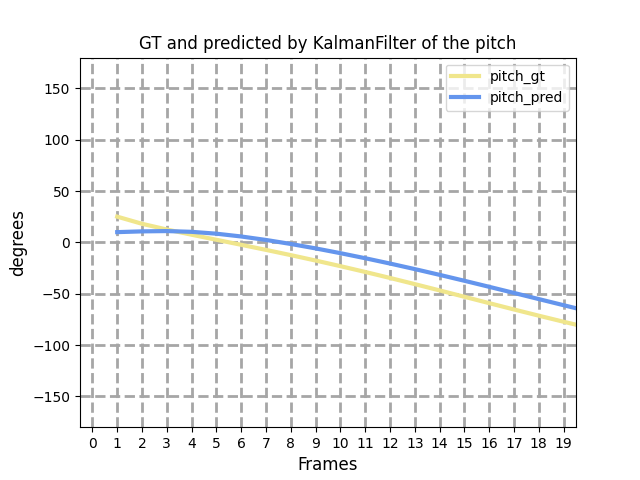
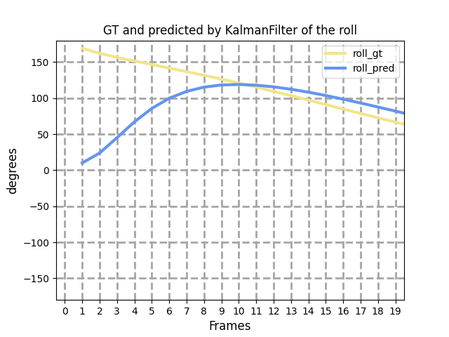

**本工作的目的：**

输入一段连续的卫星图像序列，识别并抽取异常卫星图像序列，并获得准确的估计结果。

**本周工作：**

使用了卡尔曼滤波来估计卫星的姿态，用于对比生成的卫星图像的卫星姿态。
$$
\left[\begin{matrix}
\theta_{rot}^{k}\\
\phi_{rot}^{k}\\
\omega_{rot}^{k}\\
\end{matrix}
\right]=
\left[\begin{matrix}
1&0&0\\0&1&0\\0&0&1
\end{matrix}\right]
\left[\begin{matrix}
\theta_{rot}^{k-1}\\
\phi_{rot}^{k-1}\\
\omega_{rot}^{k-1}\\
\end{matrix}
\right]+
\left[\begin{matrix}
\Delta t&0&0\\0&\Delta t&0\\0&0&\Delta t
\end{matrix}\right]
\left[\begin{matrix}
\theta_{_v}^{k}\\
\phi_{_v}^{k}\\
\omega_{_v}^{k}\\
\end{matrix}
\right]+W_{k-1}
$$

$$
\left[\begin{matrix}
\theta_{rot}^{k}\\
\phi_{rot}^{k}\\
\omega_{rot}^{k}\\
\end{matrix}
\right]=
\left[\begin{matrix}
1&0&0\\0&1&0\\0&0&1
\end{matrix}\right]
\left[\begin{matrix}
\theta_{rot}^{k}\\
\phi_{rot}^{k}\\
\omega_{rot}^{k}\\
\end{matrix}
\right]+V_{k}
$$

公式推导如上所示。

其中$$\theta_{rot}^{k}，\phi_{rot}^{k}，\omega_{rot}^{k}$$为k时刻的卫星旋转角，$\Delta t$为采样时间间隔， $\theta_{v}^{k}$为采样间隔（k-1时刻~k时刻）的平均角速度。

其中计算误差$W_{k-1}$设置为1e-3 测量误差$V_{k-1}$设置为1e-2。

收敛后pitch误差4度，yaw误差2度， roll误差4度， 总体误差在10度左右。

结果如下所示 

