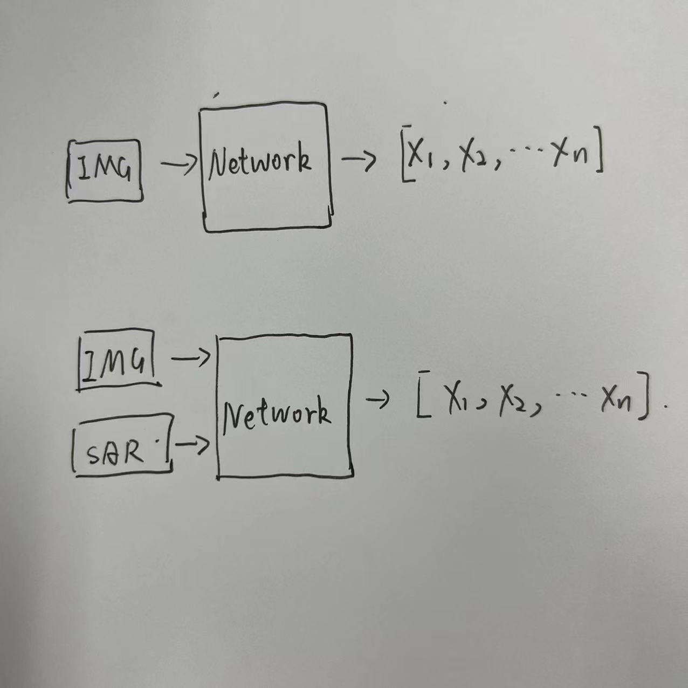
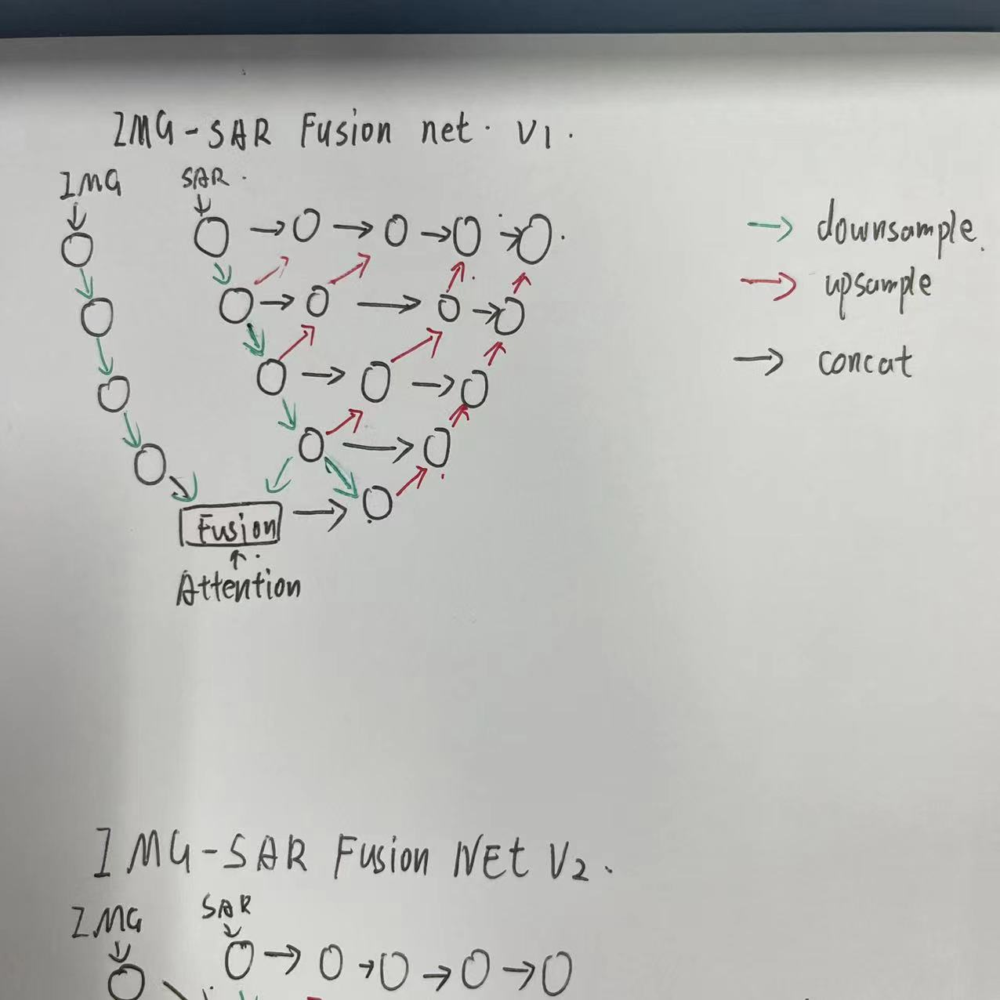
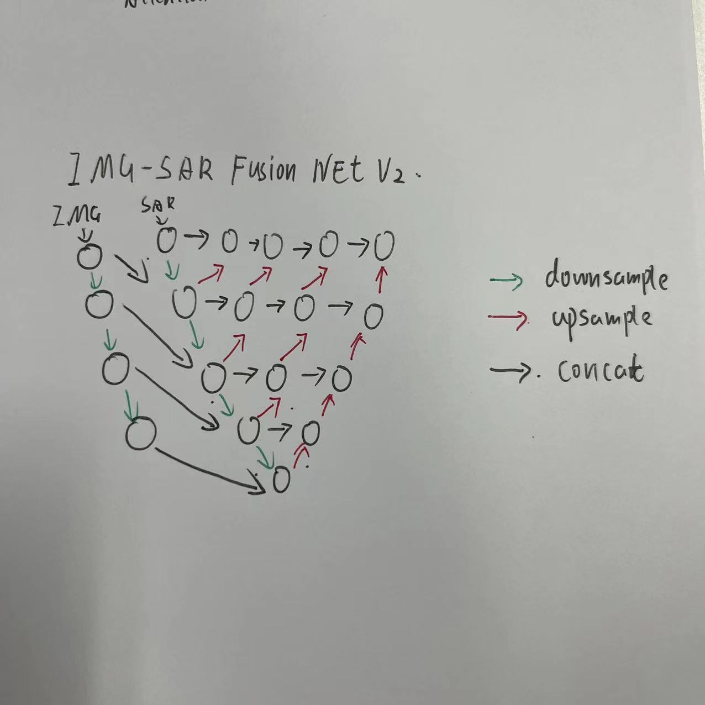
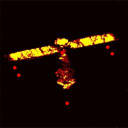
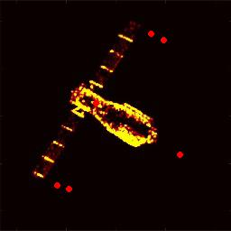
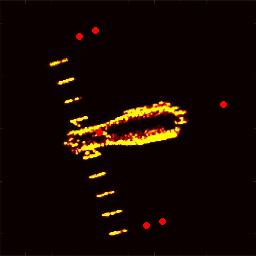
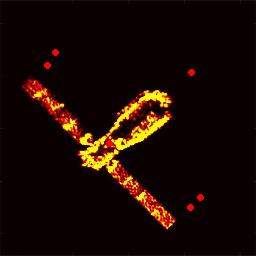
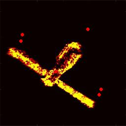

11.25

## 需求：

为了检测SAR图像的关键点的同时，还要融合光学图像的信息。

这就需要网络接收两幅图像的能力。输出时候依旧是输出关键点的序列。如下图所示

这就涉及到了卷积层面的特征融合。在特征提取时尽力提取到IMG和SAR图像对物体特征描述的相同之处。

## 网络结构：

第一种类型的网络，IMG和SAR分别提取特征，在分别进行了四次下采样后依靠Attention机制进行特征融合。为了体现IMG图像只是为SAR图像补全特征，起到辅助作用，在设计临近密度卷积块时不考虑融合IMG图像的特征。

第二种类型的网络，也是IMG和SAR分别提取特征，与第一种网络不同的是不依靠Attention机制融合特征，而是每一次下采样后就进行一次特征融合，充分融合每一层视野内的IMG特征与SAR特征。

### 第二种网络结构详细介绍：

第二种类型的网络公式描述如下:
$$
X=\Phi([I,S],\theta)
$$
其中X为关键点序列，$I$为光学图像，$S$为SAR图像，$\theta$为神经网络网络参数，也是需要训练到合适值的参数。

损失函数如下：
$$
L=w_1*L_{I}+w_2*L_{S}
$$
其中$L_I$为光学损失。 $L_S$为SAR损失。$w_1$为光学图像权重设置为0.1，$w_2$SAR图像权重0.9.

## **实验设置与实验结果**：

利用光线追踪算法生成了4250张图像，光学图像与SAR图像维度：(3,256,256)。选择2200张作为训练集，200张为测试集。损失函数为MSE， 优化器为Adam，学习率为1e-3，当当前验证集损失率累计100次高于上一次验证集损失率，学习率调整为3e-4。训练耗时10小时，共500epoch。操作系统为乌班图1804，显卡为Nvidia Titan XP。

    
    

        
    
    

平均像素误差偏移为10。