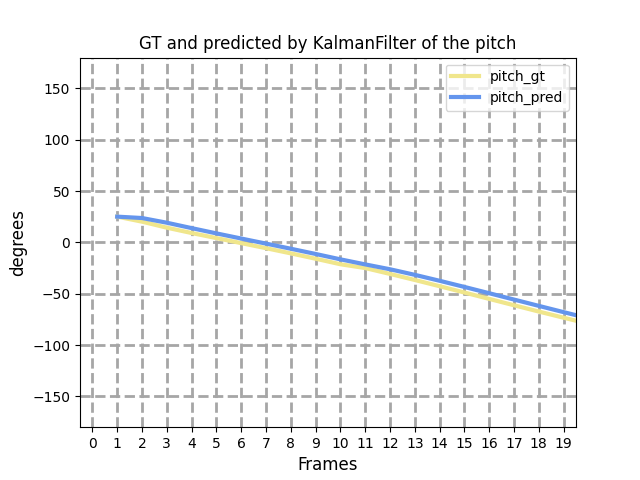
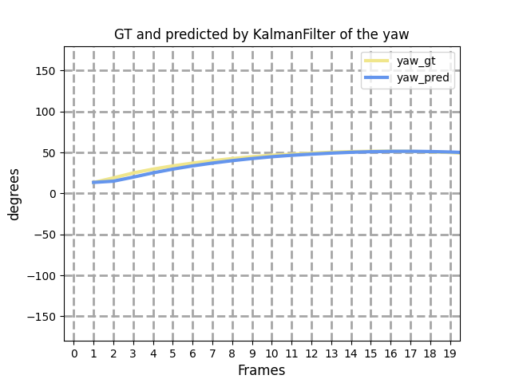
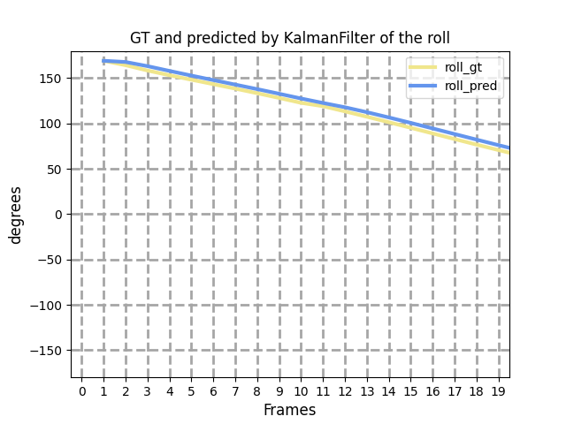

11.4

已知将世界坐标系转化为相机坐标系的公式如下：
$$
\left[\begin{matrix}
u\\v\\1
\end{matrix}\right]
=
K*
\left[\begin{matrix}
R,t
\end{matrix}\right]
*M*
\left[\begin{matrix}
X_w\\Y_w\\Z_w\\1
\end{matrix}\right]
$$

其中$k$为相机内参矩阵，$[R,t]$代表相机外参矩阵。$M$代表目标在世界坐标系的模型矩阵，描述了目标在世界中的旋转角与平移量，在实验中卫星没有转动，所以M为单位矩阵。而相机外参矩阵中的$R$表示为：
$$
R_{xyz}=R_z(\omega)R_y(\phi)R_x(\theta)
$$
如果以相机为参考系，描述卫星相对于相机的旋转运动就可以表示为：
$$
R_{xyz}^{'}=R_z(-\omega)R_y(-\phi)R_x(-\theta)
$$

以相机为参考的世界坐标系转为相机坐标系公式如下：
$$
\left[\begin{matrix}
u\\v\\1
\end{matrix}\right]
=
K*\left[\begin{matrix}R,-t\end{matrix}\right]*[R_{xyz}^{'},0]*\left[\begin{matrix}X_w\\Y_w\\Z_w\\1\end{matrix}\right]
$$
利用关键点求解完当前帧的卫星姿态后输入到卡尔曼滤波器中，对状态进行更新。
$$
\left[\begin{matrix}
\theta_{rot}^{k}\\
\phi_{rot}^{k}\\
\omega_{rot}^{k}\\
\end{matrix}
\right]=
\left[\begin{matrix}
1&0&0\\0&1&0\\0&0&1
\end{matrix}\right]
\left[\begin{matrix}
\theta_{rot}^{k-1}\\
\phi_{rot}^{k-1}\\
\omega_{rot}^{k-1}\\
\end{matrix}
\right]+
\left[\begin{matrix}
\Delta t&0&0\\0&\Delta t&0\\0&0&\Delta t
\end{matrix}\right]
\left[\begin{matrix}
\theta_{_v}^{k}\\
\phi_{_v}^{k}\\
\omega_{_v}^{k}\\
\end{matrix}
\right]+W_{k-1}
$$

$$
\left[\begin{matrix}
\theta_{rot}^{k}\\
\phi_{rot}^{k}\\
\omega_{rot}^{k}\\
\end{matrix}
\right]=
\left[\begin{matrix}
1&0&0\\0&1&0\\0&0&1
\end{matrix}\right]
\left[\begin{matrix}
\theta_{rot}^{k}\\
\phi_{rot}^{k}\\
\omega_{rot}^{k}\\
\end{matrix}
\right]+V_{k}
$$

其中$$\theta_{rot}^{k}，\phi_{rot}^{k}，\omega_{rot}^{k}$$为k时刻的卫星旋转角，$\Delta t$为采样时间间隔， $\theta_{v}^{k}$为采样间隔（k-1时刻~k时刻）的平均角速度。平均误差在4°左右，滤波结果如下图所示：

