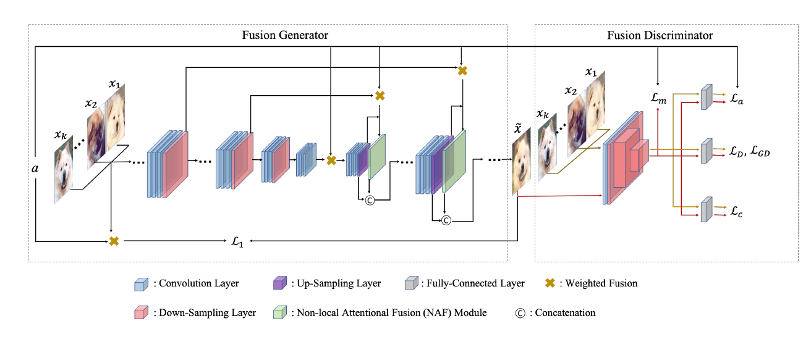
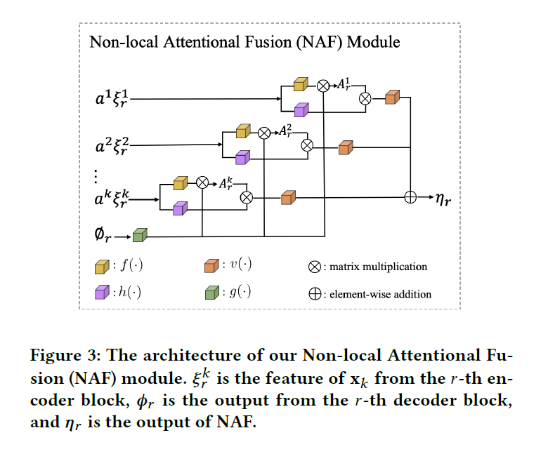
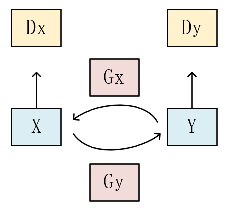

12.23

一种小样本，基于多图像深度插值融合的循环生成对抗网络（Fusing and Filling Cycle GAN）。大概结合了F2GAN和Cycle GAN的思想。我把F2GAN的小样本融合策略，并利用Cycle GAN的结构，重组了F2GAN的融合方法。

F2GAN的生成器和判别器的结构：

其中用到的融合模块NAF的结构：

分别取出**生成器**和**判别器**的部分构成Cycle Gan。

我们有两个域X，Y（光学图像，ISAR图像）的图像，分别经过Gy和Gx两个生成器进行跨域映射，分别将X，Y域的图像映射到Y，X域上，映射后只需要Dx，Dy分别计算对抗损失。
