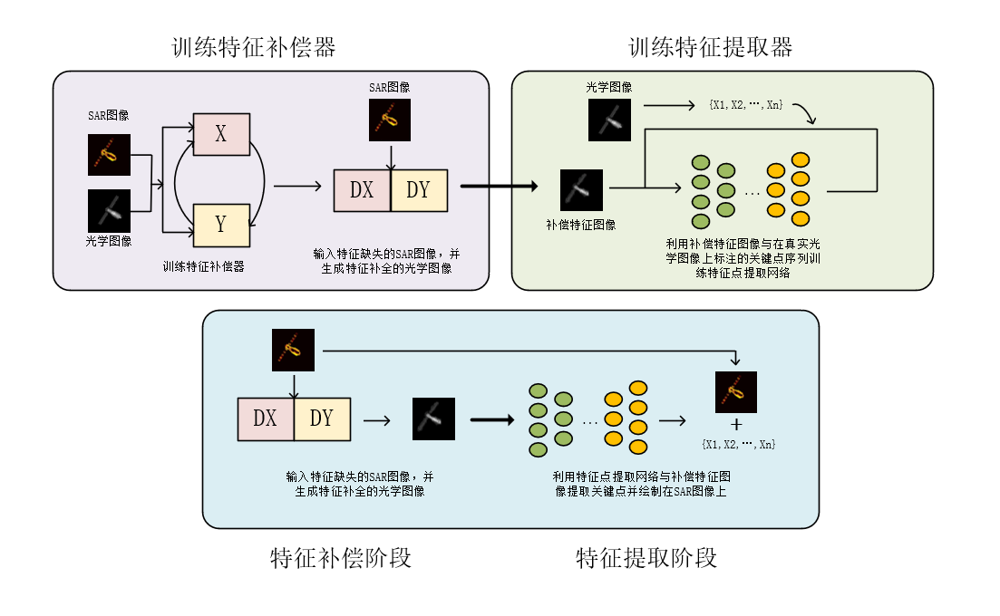
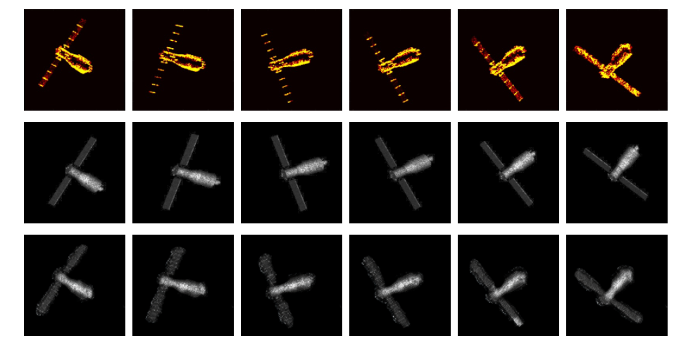
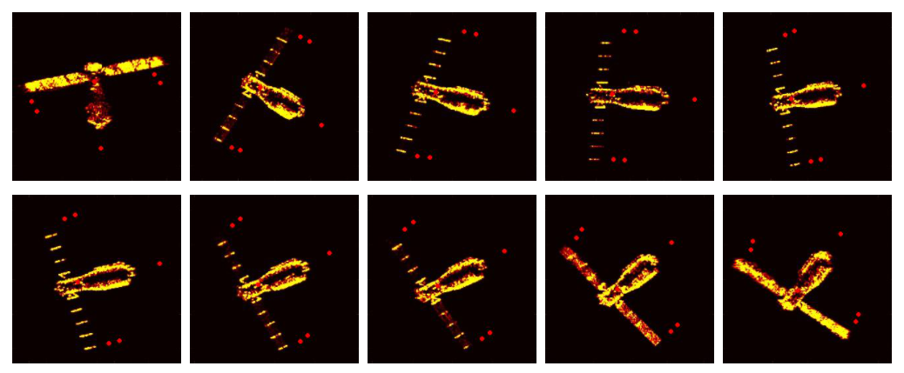

12.2new

需求：训练特征提取器，提取sar图像的特征。但是问题在于有些sar图像特征是缺失的。直接标注或利用光学图像的特征标注在缺失的sar图像的特征上面是不具有可解释性的。

解决方案：利用光学图像补全sar图像的特征。但是由于没有完全正确的sar图像，还没有办法直接利用光学图像生成完整的sar图像。所以需要利用sar图像反向生成光学图像，然后在生成的光学图像上做关键点标注工作，这样既可以补全sar图像缺失的特征，也使特征标注工作具有可解释性。

工作大体分为两个阶段——特征补全阶段，特征提取阶段。

特征补全阶段利用GAN结构网络补全，特征提取阶段利用encoder-decoder结构网络提取。

### 特征补全阶段：

利用光线追踪算法生成了10000张图像，光学图像与SAR图像维度：(3,256,256)。选择8800张作为训练集，200张为测试集。损失函数为MSE、MEAN-A，学习率为1e-3，当当前验证集损失率累计100次高于上一次验证集损失率，学习率调整为3e-4。训练耗时20小时，共200epoch。操作系统为乌班图2204，显卡为Nvidia GTX3090Ti。

特征补偿结果：

测试集图像质量评价：

PSNR:31

SSIM:0.81

MSE:780

### 特征提取阶段：

利用光线追踪算法生成了4250张图像，光学图像与SAR图像维度：(3,256,256)。选择2200张作为训练集，200张为测试集。损失函数为MSE， 优化器为Adam，学习率为1e-3，当当前验证集损失率累计100次高于上一次验证集损失率，学习率调整为3e-4。训练耗时10小时，共500epoch。操作系统为乌班图1804，显卡为Nvidia Titan XP。

特征提取结果：

平均像素误差偏移为10。