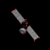

输入图像

<figure>
    </img>
    </img>
    </img>
    </img>
    </img>
    </img>
    </img>
    </img>
    </img>
    </img>
</figure>

真实图像

<figure>
    </img>
    </img>
    </img>
    </img>
    </img>
    </img>
    </img>
    </img>
    </img>
    </img>
</figure>

预测图像

<figure>
    </img>
    </img>
    </img>
    </img>
    </img>
    </img>
    </img>
    </img>
    </img>
    </img>
</figure>

<table>
   <tr>
       <td>帧</td> 
        <td>0</td> 
        <td>1</td> 
        <td>2</td> 
        <td>3</td> 
        <td>4</td> 
        <td>5</td> 
        <td>6</td> 
        <td>7</td> 
        <td>8</td> 
        <td>9</td> 
   </tr>
   <tr>
       <td>帧内关键点平均误差</td> 
        <td>0</td> 
        <td>0</td> 
        <td>0</td> 
        <td>0</td> 
        <td>0</td> 
        <td>1</td> 
        <td>2</td> 
        <td>1</td> 
        <td>1</td> 
        <td>1</td> 
   </tr>
</table>

基于LSTM的关键点预测

​	相比于HMM基于状态转移进行预测构建隐藏状态，训练隐藏状态之间的转换关系，从而进行预测任务，LSTM也包含了隐藏状态，但隐藏状态和HMM的不同，相比于HMM的one-shoot描述任务（依据表象状态推测隐藏状态，再依据隐藏状态推测下一时刻的表象状态），LSTM的隐藏状态是分布式描述一个任务，表象状态会激活每一个隐藏状态，每一个隐藏状态会依据权重推测下一个状态。

​	下图为LSTM状态传递，其包含输入状态x，隐藏状态h，输出门c，以及两个记忆门，遗忘门m_l与记忆门m_s,m_l负责长期记忆，会选择性遗忘不重要的特征（对时间久远的隐藏状态减少权重），m_s负责短期记忆，设计者认为短期之内的大多数隐藏状态都是有效的（对时间临近的隐藏状态增加权重）。	

​	LSTM并联，将本层的隐藏状态h作为输入状态x输入到另一个LSTM中。指数级增加隐藏状态，相当于CNN中增加特征提取层。

设置两个LSTM预测器，分别预测关键点x，与关键点y的位置。其中每一个预测器的隐藏状态设置为196，层数设置为2，四层LSTM并联。数据集数量170组，batchsize=2，学习率1e-3，优化器为adam，损失函数为MSE

训练轮数为300，实验结果：

<table>
   <tr>
       <td>帧</td> 
        <td>0</td> 
        <td>1</td> 
        <td>2</td> 
        <td>3</td> 
        <td>4</td> 
        <td>5</td> 
        <td>6</td> 
        <td>7</td> 
        <td>8</td> 
        <td>9</td> 
   </tr>
   <tr>
       <td>帧内关键点平均误差</td> 
        <td>3</td> 
        <td>3</td> 
        <td>4</td> 
        <td>3</td> 
        <td>6</td> 
        <td>5</td> 
        <td>6</td> 
        <td>3</td> 
        <td>3</td> 
        <td>4</td> 
   </tr>
</table>

总结，相比之下略好于卡尔曼。
