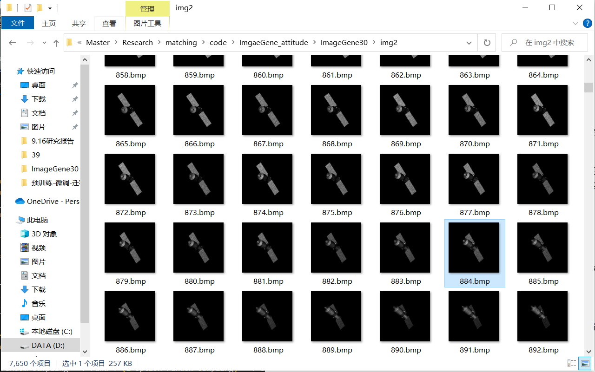

# 2023.10.7周报

##### 1、与马国林共同完成卫星姿态估计的调研报告。

##### 2、思考了一下如何在一个网络参数下实现多个目标的特征提取工作。

​	2.1主要考虑做模型的微调(fine-turning)，但是微调主要针对两个目标的微调，找到两个目标经过权衡后的最优解。相比于单个目标的模型，性能肯定是劣化的，但是优势是一套参数可以同时识别两个目标。参考论文：A Survey on Transfer Learning

​		2.2微调一般可以插入两个不同的目标，再多性能会劣化得更厉害，所以不建议再多放入更多目标，如果还想将更多目标放入一个网络中还没发现更合适的方法。

##### 3、数据生成情况

​	3.1卫星在世界坐标系转动公式如下
$$
x=r*sin(\theta)*cos(\phi) \\
y=r*sin(\theta)*sin(\phi) \\
z=r*cos(\theta)
$$
​	其中$r$为参考距离，$\theta$，$\phi$分别为相对于x-y轴旋转角度，和相对于x-y-z旋转角度。两个角度被均匀划分为90个值，所以最多有8100个姿态，值域分别为$[-1, 1]$, $[0, 1]$，但要提到的是卫星在世界坐标系中不是线性变化的。

   每一组图像有90张图像，共有90组，共生成了8100张图像。去除了低质量的图像组，剩余7650张图像，由于每90张图像为一组，所以制作变速运动的数据集只能使用这90张图，但这90张图又固定有2张图没有任何图像（漆黑一片），所以只能在这88张图中发挥。

​	目前考虑两个方案生成变速运动图像

​	1、给定较大角初速度$v_0$，给定一个针对$\theta$，的负数角加速度$\omega_\theta$，使得速度$v_0$从整数变为负数，数据集使用的图像就可以重复利用。

​		0，24，44，60，72，80，84，80，72，60，44，24，0

​	2、给定一个较小角初速度$v_0$，给定一个针对$\theta$，的正数角加速度$\omega_\theta$，使得速度$v_0$逐渐变大。

​		0，2，5，10，18，30，46 ..... (< 88)
$$

$$
