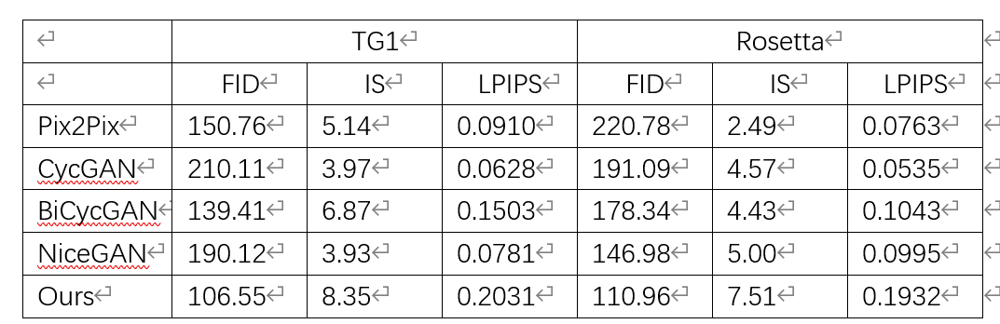
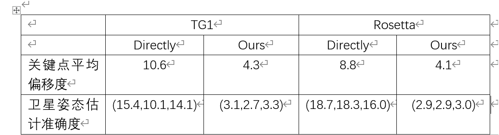

4.21

1、**完成了生成图像质量评估实验**

​	使用测试集微调imagenet预训练的Inception-V3模型，以计算生成图像的IS。FID用于测量两组图像之间的相似性。删除了imagenet预训练的Inception- V3模型的最后一个平均池化层作为特征提取器。并基于提取的特征，计算生成的图像与未见类别的真实图像之间的Fréchet Inception Distance。LPIPS用于测量生成图像之间的平均特征距离，为每个类别计算生成的图像之间的成对距离的平均值，然后计算所有未看类别的平均值作为最终的LPIPS分数。实验结果如下

2、**特征提取实验与姿态估计实验**

3、论文实验部分正在撰写中