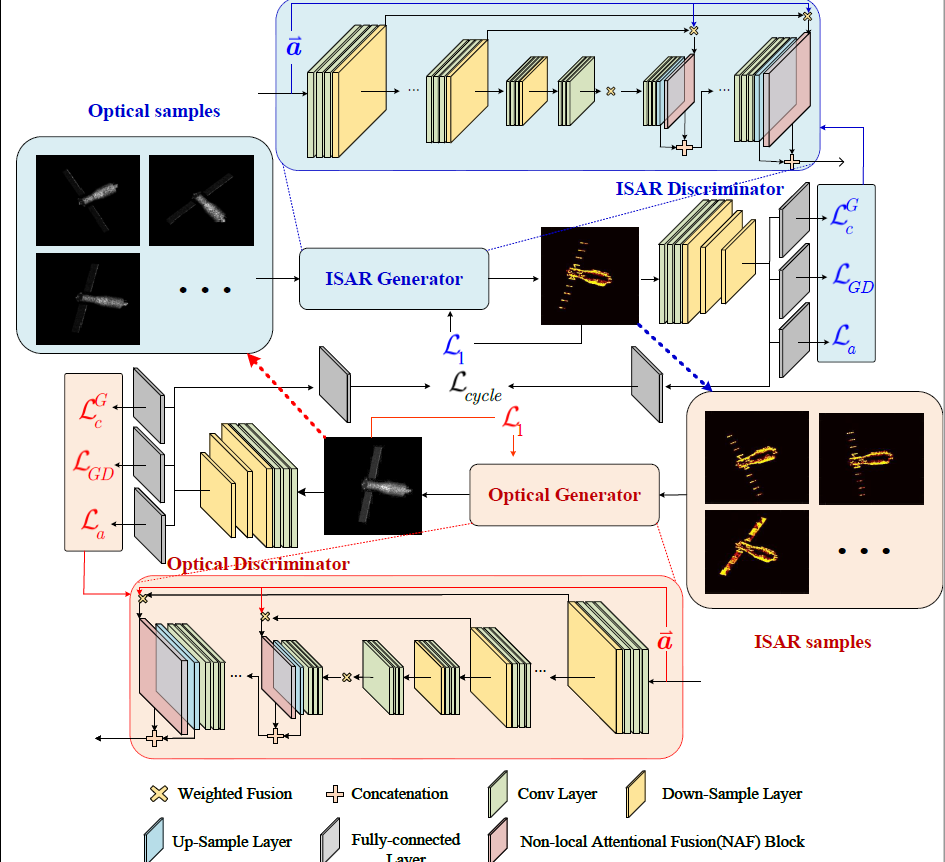

# 2022-2023下半学期期末总结

## 一、目标

1、完成特征补全工作论文《Dynamic estimation of spin satellites based on the feature
translation between Optical and Radar images》的撰写工作
2、完成时空预测工作论文的撰写工作。

### 1.1 目标一

#### 项目描述

特征补全工作，利用光学图像完整的特征补全ISAR图像缺失的特征。

#### 结果描述

成功的补全了ISAR图像缺失的特征，并完成了论文的写作与发表。

### 1.2 目标二

#### 项目描述

利用已有的卫星序列图像，预测未来卫星的运动变化，并以图像表达、使用卡尔曼滤波预测关键点的
运动轨迹

#### 结果描述

实验都没做完：关键点轨迹预测工作还没做完。

## 二、完成事项与未来规划

### 2.1完成事项

1、完成特征补全工作的全部实验，并完成了该工作论文的写作与发表。

2、毕业论文的结构撰写。

### 2.2未来规划

1、完成光线追踪程序的调试与重写。

2、继续完成项目二，考虑加入关键点轨迹预测算法如HMM、LSTM等，并完成毕业论文的全部内容。