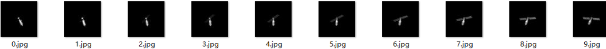
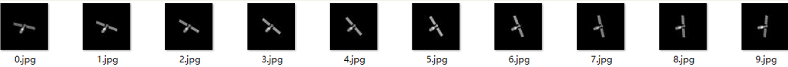
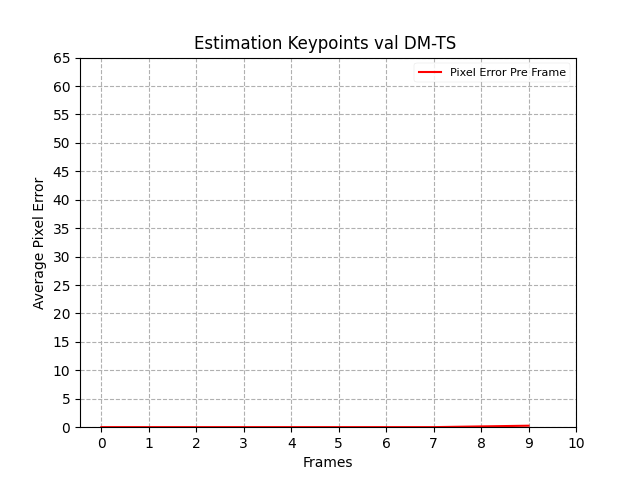
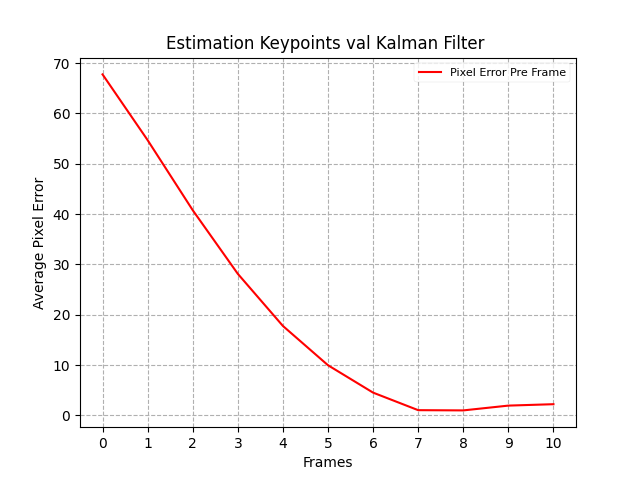
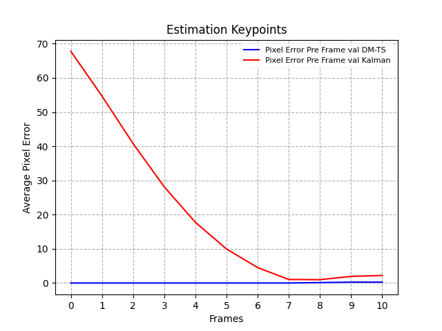

# 对比实验-卡尔曼滤波关键点跟踪实验

## 一、背景介绍

已经完成的实验，使用SD Based模型，将卫星图像作为数据特征流，输入到SD Based模型，如下图。

就可以得到如下图的预测到的特征流。

预测得到的特征流不是最终目的，还需要对特征流进行特征提取，特征提取网络使用Unet之类的分割网络。将预测特征流作为输入，输入到特征提取网络，提取目标的关键点。

对每一个特征图都提取关键点，就得到了基于数据流提取的关键点预测结果，相比于传统的关键点预测方法，如卡尔曼滤波等，除了关键点的特征，还提供了除关键点之外的特征可视化信息。**需要证明此方法比于卡尔曼滤波关键点预测算法更加准确。**

## 二、卡尔曼滤波设计

共有8个关键点，设关键点$i$在图像中的位置、观察矩阵$z_i$为
$$
z_i=[x_i, y_i]^T
$$
单个关键点的状态矩阵为
$$
X_i=[x_{i},y_{i},a_{i},b_{i}]^T=A*[x_{i-1},y_{i-1},a_{i-1},b_{i-1}]^T+\omega_{k-1}
$$

其中$a_i$为关键点坐标x的运动速度，$b_i$为关键点坐标y的运动速度，A矩阵为状态转移矩阵,$\omega_{k-1}$为相关性误差。
$$
A=
\begin{bmatrix}
1&0&\Delta t&0\\
0&1&0&\Delta t\\
0&0&1&0\\
0&0&0&1\\
\end{bmatrix}
$$
从观察矩阵转换到状态矩阵为
$$
z_i=
\begin{bmatrix}
1&0&0&0\\
0&1&0&0
\end{bmatrix}
X_i+V_{k}
$$
其中$V_k$为观测误差。

## 三、实验结果

    <figure class="half">     
             
         
	</figure>

左边的图是使用我们的方法生成后再提取关键点的结果，右边的是使用EKF的结果，可以看得出在收敛的过程中KF表现得并不好。

